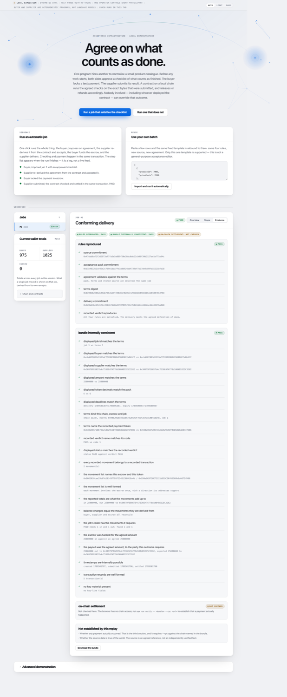

# Acceptance MVP

**Agree on what counts as done. Check the delivery. Pay by the agreed rules.**

**[▶ Run it in your browser](https://madhanj05.github.io/Sterling/)** — the published page runs the
real contracts in an Ethereum VM inside your own tab. It is not a recording or a mock: the bytecode
is the same compiled output the test suite uses, the transactions are real transactions, and the
escrow enforces the same four rules. Two demonstrations are missing there because a browser tab
genuinely cannot perform them — see [What the published page cannot do](#what-the-published-page-cannot-do).



Agents are starting to buy work from one another — a job goes out, a result comes back, and
payment settles with no human reading either one. So who decides the work was acceptable? Not the
buyer, who would rather not pay. Not the provider, who would rather be paid. Neither can judge its
own case, and nobody is going to review ten thousand small jobs by hand.

So they settle it first, in three beats.

**1 · Agree — before any work starts.** Both sides approve an **acceptance pack**: a
plain-language checklist, a coverage report saying which clauses software can actually check, and
the payment and expiry policy.

**2 · Check — against exactly what arrived.** The payment goes into escrow and the work is
delivered. A contract runs those exact rules against the exact bytes it stored.

**3 · Settle — on the result, by nobody.** It pays the provider or refunds the buyer on the
answer. Nobody can overrule it, including whoever deployed the contract. That is a testable
property of this code, not a slogan: see `tests/no-bypass.test.ts`.

> **Local simulation.** Synthetic data, disposable accounts, a mock ERC-20 with no value, no real
> money and no paid model calls. Every participant is controlled by one operator. Passing these
> tests demonstrates engineering behaviour. It is **not** evidence of customer demand, of a dispute
> rate, or that checking is cheaper than fulfilment. See [docs/limitations.md](docs/limitations.md).

## Run it

Developed and run on **Node.js 25.2.1** on macOS (arm64). `package.json` declares `>=20`, but only
25.2.1 was actually exercised — treat older versions as untested rather than supported. Nothing
else is needed: no API keys, no accounts, no network calls at runtime.

```bash
npm ci               # or npm install on a fresh checkout without the lockfile
npm start            # http://127.0.0.1:5173
```

Click **Run a job that satisfies the checklist**. That is the whole demonstration in one action;
everything else is there for scrutiny.

That starts a disposable in-process chain, deploys the contracts, and serves the web app. Stop it
with Ctrl+C; the chain and every job on it disappear with the process.

### All the commands

| Command | What it does |
|---|---|
| `npm start` | Local chain + contracts + web app on `http://127.0.0.1:5173` |
| `npm run demo` | The whole demonstration headlessly: 7 scenarios, 10 unauthorized actions, evidence written to `evidence/demo/` |
| `npm run demo -- pass` | One scenario by id (`pass`, `fail-order`, `fail-price`, `fail-rowcount`, `fail-unknown-id`, `expiry`, `unsupported-scope`) |
| `npm test` | The full test suite (194 tests) |
| `npm run smoke` | Real headless Chrome against the web app; writes screenshots to `evidence/screenshots/`. Includes a measured WCAG AA contrast check on every disclosure and note |
| `npm run verify -- evidence/demo/job-1-pass.json` | Offline verification of a bundle. A path is required; this does not verify every bundle it can find |
| `npm run verify -- <bundle> --rpc <url>` | ...and establish that the settlement actually happened on that chain |
| `npm run benchmark` | Comparable gas and timing for the three settlement paths, into `evidence/benchmark.json` |
| `npm run compile` | Recompile the contracts with the pinned solc |
| `npm run vectors` | Regenerate the independent golden encoding vectors (needs Python 3) |
| `npm run typecheck` | `tsc --noEmit` |
| `npm run build` | Production bundle of the web app into `dist/` |
| `npm run serve` | Serve that bundle instead of the Vite dev server |
| `npm run test:watch` | The test suite in watch mode |
| `npm run deploy:testnet` | Milestone E. Prints exact prerequisites and deploys nothing without them |
| `npm run reset` | Delete this project's build output and generated evidence. Touches nothing else |

`npm run smoke` needs Google Chrome installed; set `CHROME_PATH` if it is not in the default macOS
location. Everything else runs with no external programs.

Sessions are independent, so these can be run in any order and at the same time: each gets its own
disposable chain, its own `build/sessions/<id>/runtime.json`, and its own evidence directory. Every
agent subprocess is told which session to use explicitly, and refuses to start without it.

## What the demo shows

Seven scenarios, each creating its own separate job — one job never reaches two different outcomes:

| Scenario | What happens |
|---|---|
| Conforming delivery | All four rules hold. The provider is paid. |
| Right data, wrong sort | Every row correct, two products out of order. Buyer refunded on rule 4. |
| A price was altered | One price differs from the approved source. Buyer refunded on rule 3. |
| A row is missing | Eleven rows against an agreed twelve. Buyer refunded on rule 1. |
| An invented product | A product never in the source appears. Buyer refunded on rule 2. |
| Nothing delivered | Provider never submits. After expiry the buyer recovers the escrow. |
| A clause software cannot check | The pack says "make the descriptions persuasive". The job **cannot be created** until scope is revised explicitly. |

Then ten unauthorized actions are really attempted against the running chain, and what the contract
actually did with each is recorded.

The interesting one is "right data, wrong sort": the delivery is completely correct in substance and
still fails an agreed term. That is the case a human reviewer waves through and an evaluator asked
to judge freely is least consistent on.

## Settling in one transaction

By default the provider previews its own output, then **submits and settles in a single
transaction**: the contract records the delivery, evaluates it and pays or refunds atomically. This
removes the gap in which valid work sits waiting for someone to request settlement.

It grants no new authority. The caller must be the provider, supplies rows and never a verdict, and
the same immutable policy decides. If the policy cannot complete, the whole transaction reverts and
nothing is recorded, so the provider may retry — with `submitAndSettle` or with the two-step
`submitDelivery` then `settle` — up to the delivery deadline. If it never succeeds, the agreed
expiry refund applies. There is no admin override here or anywhere.

The two-step path remains, is still tested, and is what the expiry scenarios use.

A provider refuses to submit a delivery that fails its own preview. The demonstration scenarios
that show a genuine FAIL pass `--demonstrate-nonconforming` explicitly; nothing does it by accident.

## The four rules

Frozen for version 1, evaluated in this fixed order, first violation reported:

1. **Row count** — the result has exactly the agreed number of rows.
2. **Identity** — every product from the approved source appears exactly once, and nothing else.
3. **Price** — each price is unchanged from the approved source.
4. **Order** — product IDs strictly increasing.

A clause that does not reduce to one of these is classified `JUDGEMENT` or `EXTERNAL_ASSERTION` in
the coverage report and **blocks the automatic flow**. There is no button that quietly deletes it.
The only route forward is an explicit scope revision, which produces a new pack version where the
clause is still listed, marked `EXCLUDED_BY_REVISION`, with its reason attached — so both parties
can see exactly what the payment no longer depends on.

## How it is put together

| Piece | File | Responsibility |
|---|---|---|
| Policy contract | `contracts/CatalogueNormalizationPolicyV1.sol` | Stateless, pure. The only thing that can produce a verdict. |
| Escrow contract | `contracts/AcceptanceEscrow.sol` | Terms, escrow, one delivery, settlement. No owner, no admin, no upgrade path. |
| Test token | `contracts/MockUSD.sol` | A worthless local ERC-20 with an open faucet. |
| Canonical encoding | `src/shared/encoding.ts` | The commitment scheme. Frozen in `docs/encoding.md`. |
| Import boundary | `src/shared/importJson.ts` | Strict JSON validation. Nothing is coerced, rounded or dropped silently. |
| Local checker | `src/shared/policy.ts` | Readable rule-level findings. **No settlement authority.** |
| Acceptance pack | `src/shared/pack.ts` | Clauses, coverage report, scope revision, template reuse. |
| Buyer agent | `src/agents/buyer.ts` | Separate process, own identity. Creates and funds. |
| Provider agent | `src/agents/provider.ts` | Separate process, own identity. Verifies terms itself, transforms, submits. |
| Session | `src/chain/session.ts` | The named actions the CLI and the web server both drive. |
| Server | `src/server/index.ts` | Loopback only. Named demo actions only. |
| Web app | `src/web/` | The five-step interface. |

Two contracts rather than one: the escrow holds an **immutable** pointer to the policy set at
construction, so the policy governing an existing job cannot be replaced, and the escrow contains
no verdict logic of its own to disagree with it.

The agents are **deterministic programs, not language models**. Given the same job they produce the
same bytes every time. The default demo works with no API key and makes no model calls.

## The agreement is validated, not just fingerprinted

Matching fingerprints are not enough. A pack can be perfectly well formed, hash exactly as
advertised, and still describe a different sum of money, a different source batch, or a promise no
check covers. `src/shared/agreement.ts` is the single validator every client runs before creating,
before accepting, before funding, and inside evidence verification. It checks:

- the pack's format, template, checker identity and version, rule mask and row count;
- that every rule 1–4 is claimed by exactly one clause, and that a clause labelled `EXECUTABLE`
  carries **exactly the template text** for the rule it names — a label does not create a check;
- that no clause needing judgement remains, unless it was excluded by an explicit scope revision;
- that the pack's source digest, row count, rule mask, policy, **amount** and **payment-token
  address** all match the terms the contract actually stored;
- that the promised delivery and settlement windows match the deadlines on chain exactly;
- that the caller is the party it believes it is, on the chain and escrow it believes it is on.

It cannot read English, and does not pretend to. It proves a clause's text is the template's text;
it cannot prove that a sentence has been adequately captured by a check.

## Is it actually enforced?

The honest phrasing is **"contract-enforced under the demonstrated rules"**, not "all trust
removed". What is genuinely enforced, and tested:

- `settle(uint256)` takes a job id and nothing else. There is no verdict argument anywhere in the
  contract, and no overload that accepts rows. It reads its own stored source and stored delivery.
- The escrow moves exactly **one** ERC-20, fixed immutably at construction, which must have code at
  that moment. Transfers go through OpenZeppelin `SafeERC20` and the escrow verifies the exact
  balance delta both ways, so a token that delivers less than it promises reverts.
- The escrow has no `owner`, no admin role, no pause, no upgrade proxy, no withdrawal function and
  no way to change a job's recipient. The deployer holds no privilege; it can call `settle()` and
  gets the same answer as anyone else.
- A reentrant payment token cannot double-settle or drain the escrow.
- If the policy cannot answer, the job stays exactly where it was. There is no admin override; the
  agreed expiry path is the only route left.

What is **not** removed: the operator controls every participant and the chain itself; the source
data is an agreed reference, not an independently verified fact; and refund-after-expiry can strike
a conforming delivery whose settlement was never requested in time. The interface says so.

## Cross-implementation agreement

The commitment scheme is implemented three times, independently:

- **Python**, by hand from `docs/encoding.md`, with Keccak-256 written from the permutation spec —
  `scripts/gen-golden-vectors.py`. It imports neither ethers nor solc.
- **TypeScript**, via ethers — `src/shared/encoding.ts`.
- **Solidity**, via solc — `contracts/Types.sol`.

`tests/encoding-parity.test.ts` asserts all three produce identical bytes and digests for nine
vectors including the empty array, both field minimums, both field maximums, and two arrays that
differ only in order. The checker is implemented twice and held together by
`tests/checker-parity.test.ts`, which compares TypeScript against the deployed contract on 300
generated batches **without consulting any expected-result function** — and then asserts the
generator actually reached every interesting outcome.

## Evidence

`npm run demo` writes one bundle per job to `evidence/`, plus `evidence/demo-results.json`.
`npm run verify` replays a bundle with no network access.

A bundle answers three separate questions and the verifier reports three separate verdicts:

1. **rules reproduced** — rows hash to the commitments, the agreement validates, and the recorded
   verdict is what the rules produce.
2. **bundle internally consistent** — every value repeated for a human reader (displayed recipient,
   amount, status, parties, chain, addresses) agrees with the terms the bundle also carries; the
   reported balance changes **and every movement summary** are re-derived from the movement list
   they claim to summarise, the movement count matches what the job's state requires, and the
   timestamps are possible under the agreed deadlines.
3. **on-chain settlement** — only with `--rpc`, and only if **the job the chain actually stored**
   matches the bundle field for field (terms digest, source/pack/delivery commitments, parties,
   asset, amount, deadlines, status, verdict, all three timestamps, and the stored rows themselves),
   this job's movements recomputed from its own receipts match the reported balance changes, every
   transaction is
   addressed to a named contract and carries a log for this job, the escrow's own event says the
   same thing, and the token moved the exact amount to the exact recipient — on the refund branch
   as well as the payout branch.

   That stored-job comparison is the load-bearing one. Without it, an internally perfect forgery —
   every row rewritten, every dependent hash recomputed, the genuine receipts kept — passes
   everything else.

Without `--rpc`, the third is printed as **NOT CHECKED**. It is never printed as passed.

No bundle contains key material. The demo accounts are generated from fresh entropy at startup,
held in memory only, and never written to disk, logged, exported, or sent to the browser.

## Deploying it

`main` deploys to GitHub Pages through `.github/workflows/pages.yml`. The workflow runs the
compiler, the type checker and the **full 201-test suite before it will publish** — a page claiming
contract-enforced settlement should not ship on a red build.

```bash
npm run build:static          # the same build the workflow makes, into dist/
BASE_PATH="/Sterling/" npm run build:static   # as a project site would be served
```

`VITE_STATIC=1` swaps the backend from the local Node server to an EVM in the browser. Both drive
the identical job lifecycle and the identical shared modules — encoding, policy, pack, agreement,
transfers, evidence — so the rules being enforced are the same rules the tests check.

### What the published page cannot do

Two things are **absent rather than simulated**, and the interface says so:

- **The buyer and provider as separate operating-system processes.** A tab cannot spawn processes.
  Showing the same code in-page under that label would claim something untrue, so the panel is not
  there.
- **The ten unauthorized actions.** Worth watching against a chain you started yourself.

Both are in this repository. Clone it and run `npm start`.

The CLI tools — `npm run demo`, `npm run verify`, `npm run benchmark` — are local-only for the same
reason: they are Node programs, not web pages.

## Where to read next

- [`docs/encoding.md`](docs/encoding.md) — the frozen commitment scheme, written before any consumer of it.
- [`docs/demo-script.md`](docs/demo-script.md) — a five-minute presenter script.
- [`docs/limitations.md`](docs/limitations.md) — what this does not do, does not prove, and gets wrong.
- [`docs/review-response.md`](docs/review-response.md) — four rounds of independent review, what changed for each finding, and what remains inherently limited.
- [`docs/acp-status.md`](docs/acp-status.md) — official ACP integration: **not integrated**, with verified facts and blockers.
- [`fixtures/README.md`](fixtures/README.md) — every fixture and why it passes, fails, or is unsupported.
